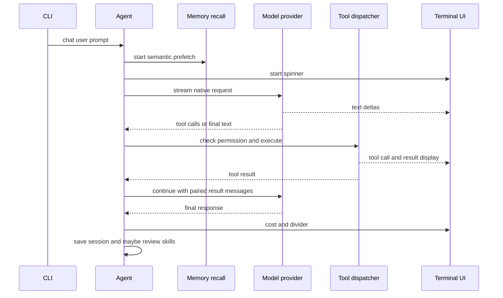
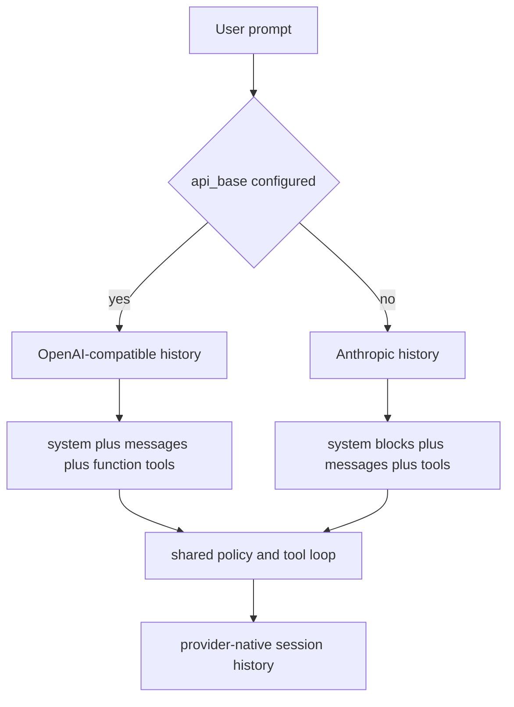

# Agent Runtime Architecture

Mini Claude is a terminal client with a stateful runtime core. `python/mini_claude/__main__.py` owns command-line parsing, environment and credential selection, one-shot versus REPL process control, SIGINT handling, and final cleanup. `Agent` owns the mutable state and asynchronous turn loop: prompts and histories, model clients, tool capability set, permission and plan state, budgets, memory recall, MCP connections, and autonomous-mode state.

The terminal UI is intentionally not a second runtime. `python/mini_claude/ui.py` renders streamed assistant text, tool activity, diagnostics, costs, approval views, and a process-global spinner. The CLI supplies `Agent` with the input/approval callbacks it needs; the agent emits UI events through the renderer functions while keeping control-flow and policy decisions in the core.

This diagram shows the normal main-agent turn. A tool-bearing response continues the loop until the provider returns no tool calls.

## Startup And Entrypoints

`main()` loads dotenv configuration, resolves a permission mode from mutually prioritized flags, resolves the model and backend from CLI options and environment variables, creates one `Agent`, and optionally restores the most recent serialized history. An API base selects the OpenAI-compatible path; otherwise the resolved Anthropic key/base selects the Anthropic path. Missing credentials terminate before an agent is created.

A positional prompt runs exactly one `chat()` under `asyncio.run()` and calls `close()` in a `finally` block. Without a prompt, `run_repl()` installs confirmation and plan-approval callbacks, reads commands or ordinary input, and calls `close()` when the interactive loop exits. SIGINT first stops active goal/loop drivers and cancels an in-flight agent task; a second interrupt exits the REPL.

The REPL owns only user-facing commands. `/clear`, `/plan`, `/cost`, and `/compact` call state methods on the existing agent. `/goal` and `/loop` invoke their drivers, `/memory` and `/skills` inspect stores, and an invocable `/skill-name` either resolves an inline prompt or asks the agent to invoke a forked skill. Normal input calls `Agent.chat()`.

## Runtime State And Provider Split

An `Agent` instance is a session runtime, not merely an API client. It has a generated session ID and tracks token and cache usage, model context capacity, tool iterations, pending cancellation task, confirmed permission scopes, plan approval state, read-before-edit file timestamps, memory prefetch progress, MCP manager state, and goal or loop state.

The runtime preserves **separate provider-native histories**:

- Anthropic history contains role messages whose assistant content is a list of text and `tool_use` blocks, with tool results returned as a user message containing `tool_result` blocks.
- OpenAI-compatible history begins with a system message and uses assistant `tool_calls` plus individual `role: tool` messages keyed by `tool_call_id`.

This split avoids translating an accumulated transcript between incompatible tool grammars. `chat()` chooses one backend at construction time from `api_base`; it never switches histories during a session. The OpenAI-compatible request converts the internal Anthropic-shaped tool definitions to function-tool objects, while the Anthropic request sends the active definitions directly.

This diagram shows the representation boundary: request serialization differs, while execution policy remains shared.

### Prompt Layers

Without a custom system prompt, prompt construction has three ownership layers:

1. The static system template is invariant across users and sessions.
2. A dynamic system tail adds environment, working directory, platform, shell, git context, persistent memory index, available skills, custom subagent descriptions, and deferred-tool names.
3. Project instructions from the nearest ancestor chain of `CLAUDE.md`, `.claude/rules/*.md`, and the current date are wrapped in a `<system-reminder>` and inserted only into the first user message.

Anthropic requests preserve this distinction using a cache-control marker on the static system block and a copied message list with an ephemeral breakpoint on its final eligible block. The persistent transcript is not mutated with request-only cache metadata. The OpenAI-compatible path combines static and dynamic system content into its initial system message and relies on the provider's caching behavior.

Skills are prompt/capability extensions, not a replacement system prompt. `SkillStore` discovers user and project skills, and the dynamic prompt exposes only an index. The model can use `skills_list` and `skill_view` to load full content. An inline skill returns its rendered instructions into the parent turn; a `context: fork` skill gets an isolated child `Agent` with its configured tool subset and returns only the child result text.

### Memory Is External Persistent Context

Persistent memory lives as frontmatter-bearing Markdown under a project-hashed `~/.mini-claude/projects/.../memory` directory, separate from conversation sessions. Its index is included in dynamic context. For a substantial user query, the main agent starts a side model query to select relevant memory files without blocking the first model request. When the prefetch is ready, selected bounded content is injected as `<system-reminder>` material into the latest user message, or carried into the next turn if it finished too late. Subagents do not start memory prefetch.

This means memory is neither the primary transcript nor automatically authoritative current state: recall is selective, bounded per file and session, and old memory includes a freshness warning.

## Turn Lifecycle And Invariants

`chat()` lazily initializes MCP once for a main agent, then records the currently running task so `abort()` can cancel it. It delegates to the selected provider loop, clears the task reference in `finally`, and for a main agent prints a divider, saves the provider-native history, and may launch background skill review only after a completed, non-aborted turn.

Both provider loops follow the same lifecycle:

1. Append the user message, including first-turn project context where applicable.
2. Auto-compact only at that new user-message boundary, then start/poll memory prefetch and apply the smaller compression pipeline before each request.
3. Stream text to the UI and append the complete provider-native assistant response to history.
4. If there are no tool calls, record usage and finish the turn.
5. Otherwise increment tool-turn accounting, enforce cost/turn limits, permission-check each call, execute allowed calls, and append a result for every call before requesting the next response.

The pairing invariant is important. If a budget is exhausted after a provider returns tool calls, the runtime appends a refusal result for each outstanding call rather than dropping them; otherwise the next request would have orphaned tool calls and violate the provider message contract. Compaction likewise occurs only when the last message is plain user text so it cannot slice a tool call away from its result.

Anthropic can begin an automatically allowed concurrency-safe tool while the stream is still producing its response. The OpenAI-compatible path parses all calls first, permission-checks serially, then executes consecutive safe calls concurrently. Calls that require confirmation, are denied, or have side effects remain ordered. Large tool output is first persisted under `~/.mini-claude/tool-results` and replaced in context with a preview and retrieval path, so truncation does not discard the full result.

Transient API failures with recognized overload, reset, timeout, or 429/503/529 conditions retry up to three times with exponential backoff. Other errors escape the call. Cancellation marks the turn aborted; the CLI suppresses abort-shaped errors while reporting other failures.

## Tools, Permissions, And MCP

Tools are capability definitions and executors, not prompt text. Deferred tools are withheld from provider schemas until `tool_search` activates them. `Agent._execute_tool_call()` owns special runtime tools such as plan transitions, subagents, skills, dynamic wakeups, and MCP routing; ordinary local tools run through `execute_tool()`.

Permission rules are evaluated before mode shortcuts. Explicit deny rules always win, including `--yolo`; plan mode blocks shell and all edits except its generated plan file. Read tools and explicit allow rules run automatically; `--accept-edits` expands edit allowance, while `--dont-ask` denies actions that would need confirmation. Auto mode retains static hard floors and read-only fast paths, then uses a two-stage model classifier for remaining actions. Classifier errors or malformed verdicts fail closed, and repeated denials fall back to a human confirmation only when a callback exists.

MCP is a dynamically attached tool source. On the main agent's first chat, `McpManager` reads global settings, project settings, and `.mcp.json`, with later sources overriding prior server names. It starts each configured stdio process, performs JSON-RPC initialization and tool discovery with timeouts, and exposes each discovered tool as `mcp__serverName__toolName` to avoid collisions. Tool calls with that prefix are routed back to the owning connection. Connection failures are logged and skipped rather than preventing the primary agent from running. `close()` disconnects every MCP process; the CLI calls it on one-shot and REPL exit. Subagents do not initialize MCP.

## Planning, Subagents, And Autonomy

Plan mode is a runtime policy state, not merely an instruction. Its prompt identifies a generated file under `~/.claude/plans` as the only writable file, and the permission layer independently enforces the same rule. On `exit_plan_mode`, the CLI-provided approval callback can keep planning, restore manual confirmation, enable edit acceptance, or clear history before execution. Clearing context retains the system configuration and ensures the next user message is rebuilt through the normal first-message context path.

Subagents are independent `Agent` instances with their own system prompt, history, output buffer, and tool subset. Built-in `explore` and `plan` children expose only read tools; `general` excludes recursive `agent` invocation. Children reuse the parent model/backend credentials and shared skill store, but do not connect MCP, prefetch memory, persist sessions, or launch background skill review. The parent receives child text as a tool result and adds child token usage to its own totals. Plan and auto permission modes propagate to prevent a child from bypassing those constraints; other parent modes intentionally give children bypass permissions.

`/goal` and `/loop` are in-session drivers over normal `chat()` calls. `/goal` evaluates the latest assistant transcript using a separate deterministic evaluator query after every turn; only an evidence-backed parsed success, an impossible verdict, limits, or interruption stops it, and malformed evaluator output is treated as not met. Interval `/loop` replays a prompt on a timer and is never persisted. Dynamic `/loop` temporarily exposes `schedule_wakeup`; the model either schedules a clamped 60-to-3600-second next tick or ends the loop by omitting that tool. The driver removes this capability in `finally`, so it is unavailable outside dynamic-loop scope.

## Persistence, Limits, And Operations

After each main-agent chat, the runtime best-effort writes `~/.mini-claude/sessions/<id>.json` with metadata and the selected provider's native history. `--resume` selects the saved metadata with the latest start time and restores whichever histories are present. Session persistence does not restore MCP processes, pending memory prefetch, approval whitelist, active goal/loop state, budgets, or token counters.

Context protection is layered. At a high estimated context ratio the runtime asks the configured model to summarize old conversation while retaining the newest user message. Before individual API calls it budgets oversized tool results, snips stale results while preserving the newest results, and after idle time clears old result bodies. Cache-aware snipping avoids rewriting a hot prompt prefix unless utilization is high enough to prioritize overflow avoidance. `--max-cost` and `--max-turns` bound tool-executing turns; the goal and loop drivers add hard iteration or tick ceilings because text-only turns would not advance the tool-turn counter.

Relevant operating controls are `--model`, `--api-base`, `--thinking`, `--max-cost`, `--max-turns`, the permission flags, `--resume`, and `--skill-review-interval`; the interval may alternatively come from `MINI_CLAUDE_SKILL_REVIEW_INTERVAL`. `MINI_CLAUDE_MODEL`, backend API key/base variables, and `MINI_CLAUDE_SDK_MAX_RETRIES` also affect startup/runtime behavior. Extended thinking is enabled only for recognized supported Claude models and is an Anthropic request feature.

## Focused Verification

The highest-value tests exercise control boundaries rather than rendering:

- `python/tests/test_autonomy.py` verifies pure parsers and safety-sensitive normalizers for goal verdicts, loop input, wakeup clamping, and classifier transcript construction against shared fixtures.
- `python/tests/test_autonomy_flow.py` stubs classifier requests and verifies the one-call allow path, escalation to stage two, fail-closed parsing, denial accounting, and the read-only fast path.
- `python/tests/test_skill_agent.py` verifies that background skill review uses an isolated deep-copied snapshot and that `run_once()` preserves a child OpenAI system message while copying supplied history.

See [Context and State](/openwiki/concepts/context-and-state.md), [MCP](/openwiki/integrations/mcp.md), [Model Backends](/openwiki/integrations/model-backends.md), [Quickstart](/openwiki/quickstart.md), and [Agent Turn](/openwiki/workflows/agent-turn.md) for adjacent concepts and operational use.
